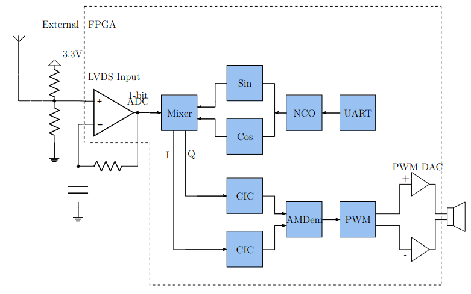
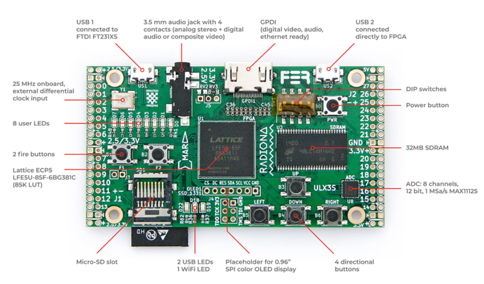
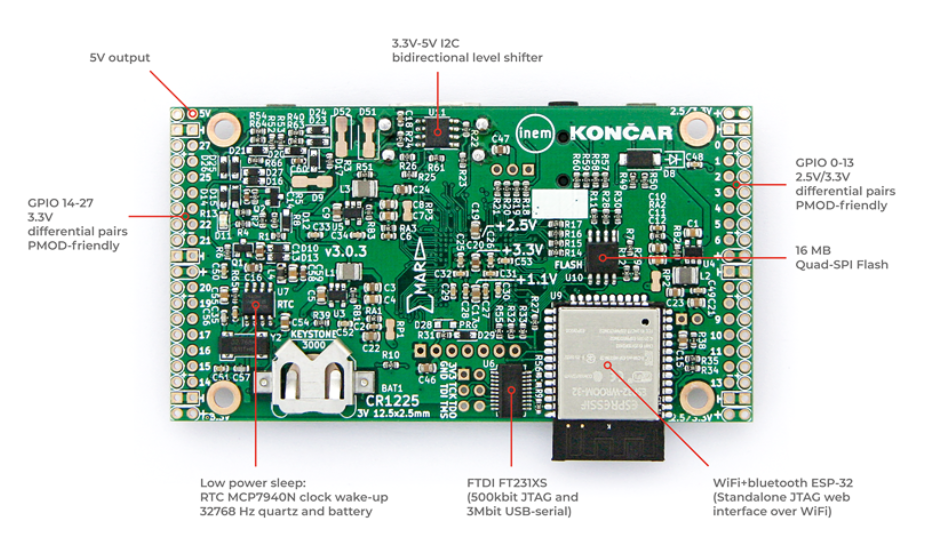
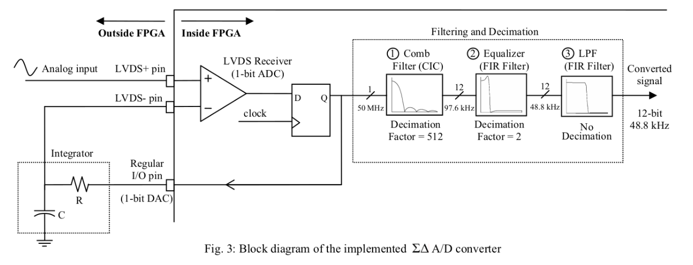
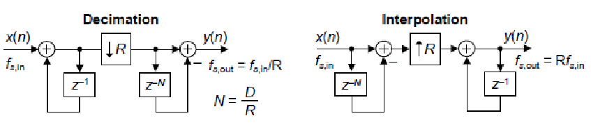
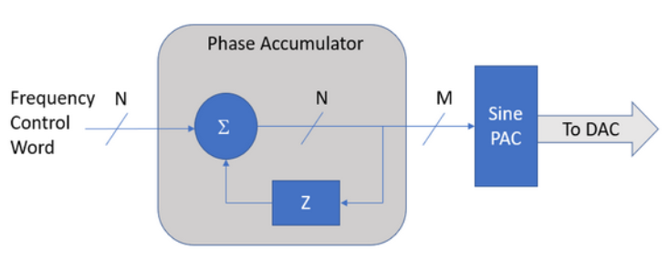

# Software Defined Radio(SDR) in High Level Synthesis(HLS)

The github repository delves into the development of a Software-Defined Radio (SDR) Receiver, which is conceptualized to operate on an Field Programmable Gate Array(FPGA) platform utilizing High-Level Synthesis (HLS). This approach is inspired by a [notable project](https://hackaday.io/project/170916-fpga-3-r-1-c-mw-and-sw-sdr-receiver) conducted on a Lattice MACHXO2 Board, which demonstrated the feasibility
of receiving AM broadcasts with minimal analog components. The project underscores the shift towards digital processing within the FPGA, highlighting the importance of a robust understanding of Digital Signal Processing (DSP) for successful implementation. HLS comes into play as an advantageous methodology for DSP applications, especially in algorithm-based designs, due to its efficiency in prototyping and testing compared to traditional Verilog-based development.

In the forthcoming sections, we will go into the operational principles of the project, alongside potential enhancements, alterations, and comprehensive discussions on the DSP Modules integral to the SDR Receiver. Additionally, the project’s transition to a different platform, specifically the ULX3S board, will be outlined. Furthermore, the performance and functionality of the SDR Receiver will be evaluated through both Verilog and High-Level Synthesis (HLS) testing methodologies.

# 1bit SDR Project

The SDR Receiver's architecture starts with an antenna capturing the RF signal, which is then enhanced through oversampling at an 80 MHz FPGA clock to improve signal resolution and quality. The signal passes through a voltage divider into a Sigma-Delta Modulator comprising a comparator (operating with LVDS) and an integrator, marking the system's transition from analog to digital. This stage outputs a 1-bit data stream, which is mixed with quadrature sine and cosine waves generated by a Numerically Controlled Oscillator (NCO). The NCO's frequency is dynamically adjustable via a UART PC connection, matching the desired carrier wave frequency.

The mixed signal, encoded with Binary Phase Shift Keying (BPSK), is filtered through a Cascaded Integrator-Comb (CIC) filter, implementing low-pass filtering and decimation (reducing the sample rate by 1/4096). Subsequently, the signal is demodulated (AM), converted into a Pulse Width Modulation (PWM) signal tailored for audio output, and finally amplified to drive speakers for sound reproduction. This process illustrates the fusion of analog and digital techniques in a modern SDR receiver for high-quality audio.

# ULX3S FPGA Board

The board used for this project is the ULX3S FPGA Board. It is a fully open-source development board for LATTICE ECP5 FPGAs. The board has extensive documentation on its GitHub, with [manuals](https://github.com/emard/ulx3s/blob/master/doc/MANUAL.md), working [examples](https://github.com/emard/ulx3s-misc) and different [projects](https://ulx3s.github.io/).

The [main github page](https://ulx3s.github.io/) for ULX3S serves as the central hub for all resources and information related to the ULX3S ecosystem.

The ULX3S board is available in various models, differentiated primarily by their Look-Up Table (LUT) sizes, including 12F, 25F, 48F, and 85F variants, where the numbers indicate the LUT capacity, such as 85K LUTs, which will be used here. These boards can be synthesized, placed, and routed using either Lattice Diamond or open-source tools. However, for programming, the boards require open-source tools like fujprog or openFPGALoader. The design and layout of the board, along with its peripherals, are showcased in the illustrations below which show the front and back sides of the board, respectively.

# DSP Modules

# Sigma-Delta (Σ-Δ) ADC Implementation for FPGA

## Overview

The Sigma-Delta (Σ-Δ) ADC is a cornerstone in modern electronic systems requiring high-resolution conversion technologies. Unlike traditional ADCs, this implementation samples at a frequency significantly higher than the Nyquist rate, using a feedback loop to minimize quantization noise and preserve the signal's fidelity.
### Key Concepts

* **Oversampling**: Increases the sampling rate to spread quantization noise across a wider frequency spectrum, enhancing signal-to-noise ratio (SNR).

* **Noise Shaping**: Pushes quantization noise to higher frequencies, leaving the signal band relatively unaffected.

* **Digital Filtering**: A subsequent digital low-pass filter removes out-of-band noise, allowing the signal to be downsampled to the Nyquist rate without loss of quality.

* **FPGA Implementation**: Utilizes an LVDS input as a comparator, minimizing external analog component requirements

# Cascaded Integrator-Comb(CIC) Filters

## Overview
Cascaded integrator-comb (CIC) digital filters are computationally-efficient implementations of narrowband lowpass filters, and are often embedded in hardware implementations of decimation, interpolation, and delta-sigma converter filtering. Large rate changes require very narrow band filters,fast multipliers and very long filters. This can end up being the largest bottleneck in a DSP system. CIC filters are well-suited for anti-aliasing filtering prior to decimation (sample rate reduction) and for anti-imaging filtering for interpolated signals (sample rate increase). Both applications are associated with very high-data rate filtering such as hardware quadrature modulation and demodulation in modern wireless systems, and delta-sigma A/D and D/A converters. Implementing an FIR filter can consume quite a bit of FPGA resources that are often scarce. An important benefit of CIC filters is that it’s implementation does not use any multipliers.

CIC filters are used for sample rate decimation and interpolation. The rate change is achieved through the repetitive application of integration and differentiation, which simplifies the design by eliminating the need for coefficient storage.
For decimation, the CIC filter structure starts with integrator stages followed by comb stages. The reverse is true for interpolation. The overall gain of the filter can be adjusted post-filtration to normalize the output.

### Practical Considerations

* **Register Word Widths**: It's essential to carefully manage word widths to prevent overflow in the integrator stages while maintaining sufficient precision.
* **Compensation Filters**: Often, compensation or preconditioning FIR filters are employed alongside CIC filters to correct for the droop in the frequency response introduced by CIC filtering, ensuring a flat passband.

# Numerically Controlled Oscillator(NCO) 

The NCO plays a pivotal role in SDR systems, enabling precise frequency synthesis for signal generation and modulation. It is essential for creating the local oscillator (LO) signals in digital mixers and modulators, facilitating various wireless communication protocols within an FPGA. These digital circuits generate a wide range of frequencies with high precision and stability, leveraging digital computational power to produce analog waveforms. Unlike traditional analog oscillators, which rely on the physical properties of components like resistors, capacitors, and inductors to determine frequency, NCOs achieve frequency generation through digital means, offering superior accuracy, flexibility,
reliablity and control. Implementing an NCO can be achieved through various methodologies, each with its unique advantages. The most prevalent techniques include the use of the Coordinate Rotation Digital Computer (CORDIC) algorithm and Sine-Lookup Tables.The CORDIC algorithm, renowned for its precision, operates through swift rotations in digital coordinates, employing only shift and add operations—thus, eliminating the need for multipliers. However, its precision comes at the cost of speed, as generating n-bit output requires n clock cycles. Consequently, CORDIC is most suited for applications demanding high precision at lower frequencies. On the other hand, Sine-Lookup Tables offer a straightforward and rapid solution at the expense of increased resource consumption and potential for higher spurious frequencies. This method is favored in scenarios requiring high-speed operation with ample hardware resources available. An NCO (Numerically Controlled Oscillator) is typically implemented utilizing a reference clock, a phase accumulator, and a lookup table (LUT) as can be seen below.

At its core, the NCO operates by incrementally adding a phase value to a phase accumulator at a constant clock rate. The phase increment size determines the output frequency. The NCO's frequency resolution and stability are highly dependent on the phase accumulator's bit-width and the system clock frequency. Software configurability allows the NCO to easily switch frequencies, phases, and waveforms, making it highly versatile for multi-standard radios.

### Practical Considerations
* **LUT Size Reduction**: Techniques such as quarter-wave symmetry can significantly reduce the size of the sine LUT, conserving memory resources.
* **Spurious Free Dynamic Range (SFDR)**: Careful design and implementation can minimize phase truncation and quantization errors, enhancing the SFDR of the generated signal.

