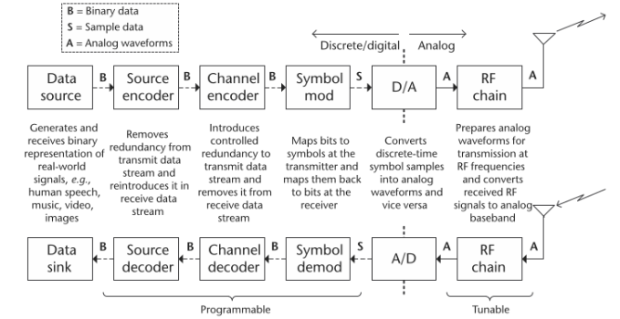
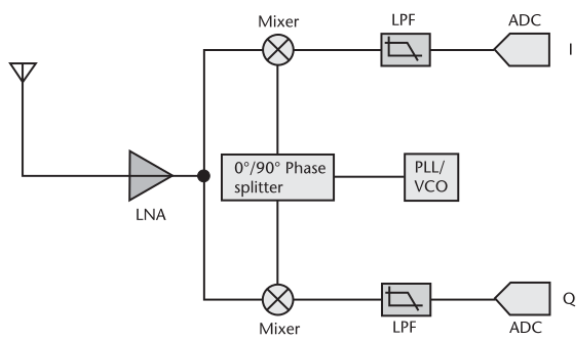
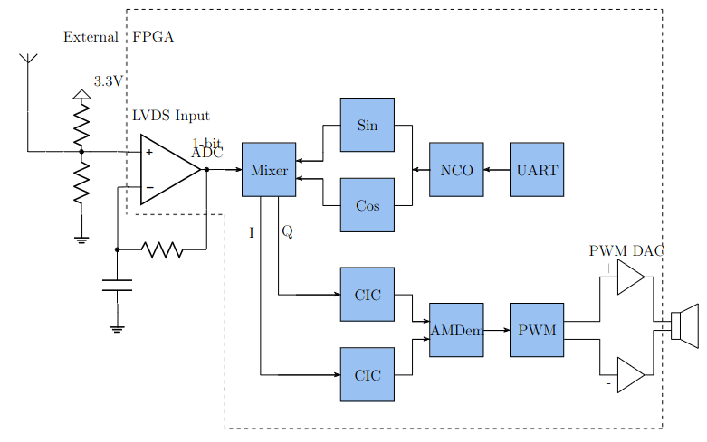
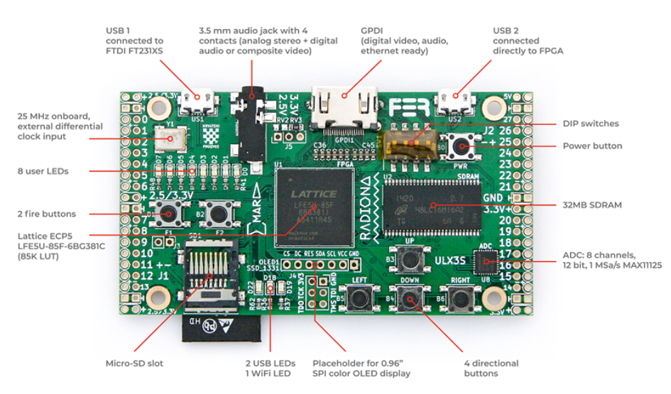
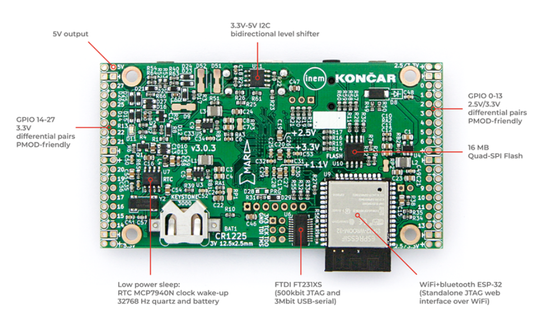
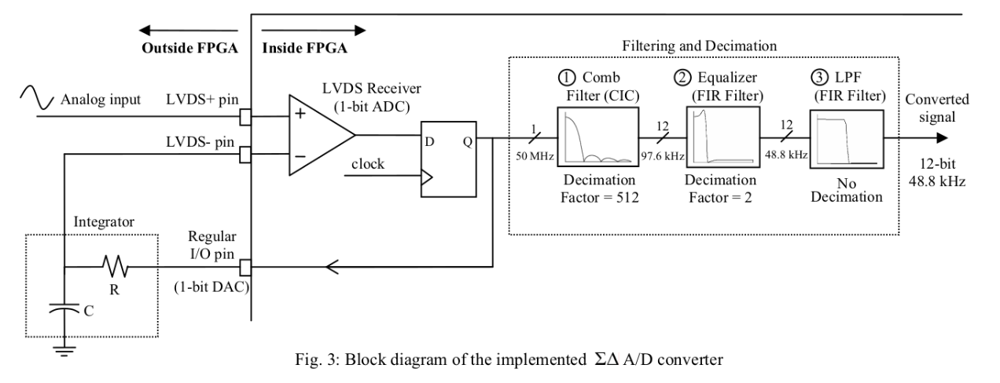
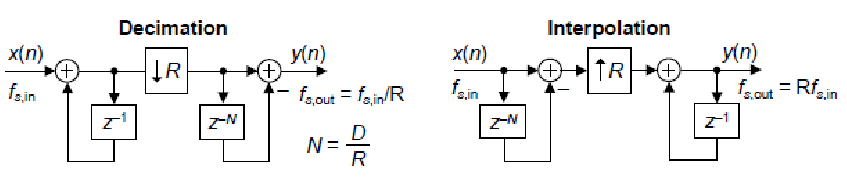
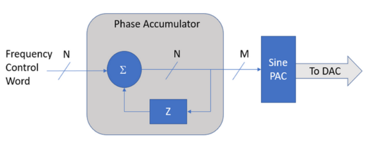
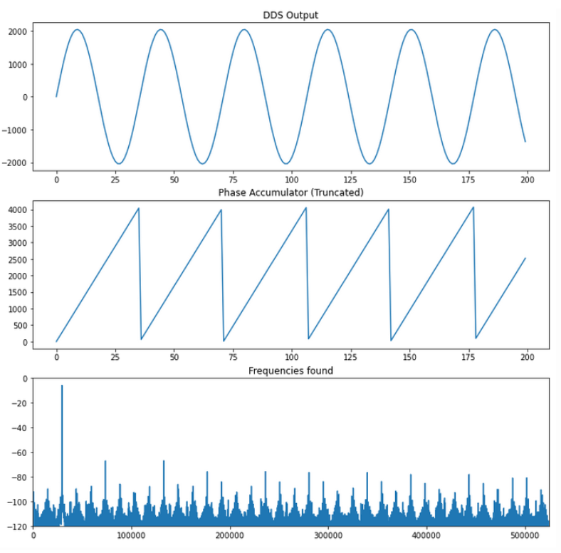

# Software Defined Radio(SDR) in High Level Synthesis(HLS)

The github repository delves into the development of a Software-Defined Radio (SDR) Receiver, which is conceptualized to operate on an Field Programmable Gate Array(FPGA) platform utilizing High-Level Synthesis (HLS). This approach is inspired by a [notable project](https://hackaday.io/project/170916-fpga-3-r-1-c-mw-and-sw-sdr-receiver) conducted on a Lattice MACHXO2 Board, which demonstrated the feasibility
of receiving AM broadcasts with minimal analog components. The project underscores the shift towards digital processing within the FPGA, highlighting the importance of a robust understanding of Digital Signal Processing (DSP) for successful implementation. HLS comes into play as an advantageous methodology for DSP applications, especially in algorithm-based designs, due to its efficiency in prototyping and testing compared to traditional Verilog-based development.

In the forthcoming sections, we will go into the operational principles of the project, alongside potential enhancements, alterations, and comprehensive discussions on the DSP Modules integral to the SDR Receiver. Additionally, the project’s transition to a different platform, specifically the ULX3S board, will be outlined. Furthermore, the performance and functionality of the SDR Receiver will be evaluated through both Verilog and High-Level Synthesis (HLS) testing methodologies.

## Repository Structure

### 0. Documentation

This folder contains:

- A detailed theoretical analysis of the concepts introduced in this project (currently in progress).
- A presentation file shared with the FPGA research team at Infineon Technologies.
- Papers closely related to the work done on this project.

### 1. RTL Implementation

Contains the Register Transfer Level (RTL) implementations of the project's designs, organized into three subfolders:

1. **hw**: Includes Verilog and SystemVerilog files for the following modules:
   - AM Demodulator
   - CIC Filter
   - Mixer
   - NCO (Numerically Controlled Oscillator)
   - PWM (Pulse Width Modulation)
   - UART Receiver
   - Top module

2. **sim**: Contains cocotb simulations for the Verilog/SystemVerilog files.

3. **lattice**: Includes Lattice Diamond synthesis files, place and route files, constraint files, and other related files.

### 2. HLS Implementation

Houses the High-Level Synthesis (HLS) implementations of the modules in the RTL Implementation. Each file includes:
- Amaranth HLS code
- Amaranth simulations
- Cocotb simulations of the generated Verilog files for verification

### 3. Testing

Contains testing modules for the following components:
- Speaker
- UART
- 1-bit ADC
- LVDS (Low-Voltage Differential Signaling)

### 4. Scripts

Includes various scripts for generating Python and Matlab graph files and simulations.

### 5. New Modules

Newly developed modules that are part of the project, written in both RTL and Amaranth HLS, including:
- Sine LUT NCO
- Sine CORDIC NCO
- Improved CIC Filter
- Square Root Module

# Software Defined Radio(SDR)

A Software-Defined Radio (SDR) system is a sophisticated device designed to enable efficient data transmission and reception. At its core, an SDR system transforms infor- mation—whether speech, music, or video—into a digital format, processes it, and then transmits it as an electromagnetic wave with specific characteristics like amplitude, frequency, and phase. This digital communication process involves converting analog signals
into binary form through quantization for digital processing and transmission. On the receiving end, the SDR decodes the transmitted signals, navigating through noise and distortion, to reconstruct the original information.

Despite the implication of the name, SDR is not confined to software or processor-based platforms alone. Its defining feature is its flexibility, enabling it to support various air interfaces and adapt the signal processing chain quickly and efficiently. This adaptability makes SDR a dynamic tool in modern telecommunications, capable of meeting the evolving demands of digital communication.

A typical Software-Defined Radio (SDR) transceiver is composed of four principal components: Signal Processing, Digital Front End, Analog RF Front End, and an Antenna.
The schematic representation of a contemporary digital communication system, depicted above, demonstrates the dynamic nature of SDR technology, emphasizing its reconfigurable and programmable capabilities.

## Zero-IF Recievers

In this project a Zero-IF Reciever Architecture is implemented. The zero-IF (ZIF) or Direct-RF architecture presents an innovative alternative to the traditional superheterodyne receiver design, streamlining the frequency
conversion process and reducing component complexity. In this architecture, the signal’s conversion to baseband is achieved through a singular frequency mixing stage, where the local oscillator (LO) is precisely tuned to the signal’s frequency band. This approach effectively translates the received signal directly to baseband, processing it in both phase (I) and quadrature (Q) components. This method significantly reduces the need for complex and expensive RF/IF filtering, as all necessary filtering is performed at the baseband level. Here, filters are simpler, more cost-effective, and easier to design.

# 1bit SDR Project

The SDR Receiver's architecture starts with an antenna capturing the RF signal, which is then enhanced through oversampling at an 80 MHz FPGA clock to improve signal resolution and quality. The signal passes through a voltage divider into a Sigma-Delta Modulator comprising a comparator (operating with LVDS) and an integrator, marking the system's transition from analog to digital. This stage outputs a 1-bit data stream, which is mixed with quadrature sine and cosine waves generated by a Numerically Controlled Oscillator (NCO). The NCO's frequency is dynamically adjustable via a UART PC connection, matching the desired carrier wave frequency.

The mixed signal, encoded with Binary Phase Shift Keying (BPSK), is filtered through a Cascaded Integrator-Comb (CIC) filter, implementing low-pass filtering and decimation (reducing the sample rate by 1/4096). Subsequently, the signal is demodulated (AM), converted into a Pulse Width Modulation (PWM) signal tailored for audio output, and finally amplified to drive speakers for sound reproduction. This process illustrates the fusion of analog and digital techniques in a modern SDR receiver for high-quality audio.

# ULX3S FPGA Board

The board used for this project is the ULX3S FPGA Board. It is a fully open-source development board for LATTICE ECP5 FPGAs. The board has extensive documentation on its GitHub, with [manuals](https://github.com/emard/ulx3s/blob/master/doc/MANUAL.md), working [examples](https://github.com/emard/ulx3s-misc) and different [projects](https://ulx3s.github.io/).

The [main github page](https://ulx3s.github.io/) for ULX3S serves as the central hub for all resources and information related to the ULX3S ecosystem.

The ULX3S board is available in various models, differentiated primarily by their Look-Up Table (LUT) sizes, including 12F, 25F, 48F, and 85F variants, where the numbers indicate the LUT capacity, such as 85K LUTs, which will be used here. These boards can be synthesized, placed, and routed using either Lattice Diamond or open-source tools. However, for programming, the boards require open-source tools like fujprog or openFPGALoader. The design and layout of the board, along with its peripherals, are showcased in the illustrations below which show the front and back sides of the board, respectively.

# High Level Synthesis(HLS)
Field Programmable Gate Arrays (FPGAs) are versatile integrated circuits that can be reconfigured after manufacturing, allowing for custom circuit implementations. This re-
configurability provides a unique advantage over fixed-architecture processors like CPUs and GPUs, making FPGAs suitable for a wide range of applications, from ASIC proto-
typing to hardware acceleration. The evolution of FPGA technology has led to increased complexity and capabilities, including multi-die devices and system-level interconnects,
encouraging both academic and industry investment. However, FPGA programming remains challenging due to its complex design process, historically reliant on Hardware
Description Languages (HDLs) such as Verilog and VHDL.High-Level Synthesis (HLS) emerges as a solution to simplify FPGA design, allowing hardware functionality to be specified through software programs at a higher abstraction level. HLS tools automate the translation of behavioral descriptions into Register Transfer Level (RTL) designs, tailored to the target technology and optimizing interface and memory elements. This approach reduces time-to-market and addresses the complexity of modern systems, offering a balance between the flexibility of general-purpose processors and the efficiency of ASICs.

## Amaranth
The Software-Defined Radio (SDR) development embraces High-Level Synthesis (HLS) through the innovative use of Amaranth. Amaranth, previously known as nMigen, represents a modern approach to hardware description, allowing for a higher level of abstraction and expressivity compared to traditional Hardware Description Languages (HDLs).

### Why Amaranth?

Amaranth offers a unique combination of advantages for our SDR implementation. Its expressive syntax and compact code representation make the design process more intuitive and significantly more efficient. Built on Python, it benefits from easy integration with the vast Python ecosystem, enhancing our capabilities in simulation, testing, and deployment. Designs crafted in Amaranth are inherently portable, making it simpler to adapt and reconfigure the SDR architecture across different FPGA platforms. Additionally, the growing community around Amaranth provides extensive resources, documentation, and support, which is invaluable for our development efforts. The strategy with Amaranth involves a modular design approach, defining key SDR components such as the Mixer, NCO, and Filters as separate, self-contained modules.

# DSP Modules

# Sigma-Delta (Σ-Δ) ADC Implementation for FPGA

## Overview

The Sigma-Delta (Σ-Δ) ADC is a cornerstone in modern electronic systems requiring high-resolution conversion technologies. Unlike traditional ADCs, this implementation samples at a frequency significantly higher than the Nyquist rate, using a feedback loop to minimize quantization noise and preserve the signal's fidelity.
### Key Concepts

* **Oversampling**: Increases the sampling rate to spread quantization noise across a wider frequency spectrum, enhancing signal-to-noise ratio (SNR).

* **Noise Shaping**: Pushes quantization noise to higher frequencies, leaving the signal band relatively unaffected.

* **Digital Filtering**: A subsequent digital low-pass filter removes out-of-band noise, allowing the signal to be downsampled to the Nyquist rate without loss of quality.

* **FPGA Implementation**: Utilizes an LVDS input as a comparator, minimizing external analog component requirements

# Cascaded Integrator-Comb(CIC) Filters

## Overview
Cascaded integrator-comb (CIC) digital filters are computationally-efficient implementations of narrowband lowpass filters, and are often embedded in hardware implementations of decimation, interpolation, and delta-sigma converter filtering. Large rate changes require very narrow band filters,fast multipliers and very long filters. This can end up being the largest bottleneck in a DSP system. CIC filters are well-suited for anti-aliasing filtering prior to decimation (sample rate reduction) and for anti-imaging filtering for interpolated signals (sample rate increase). Both applications are associated with very high-data rate filtering such as hardware quadrature modulation and demodulation in modern wireless systems, and delta-sigma A/D and D/A converters. Implementing an FIR filter can consume quite a bit of FPGA resources that are often scarce. An important benefit of CIC filters is that it’s implementation does not use any multipliers.

CIC filters are used for sample rate decimation and interpolation. The rate change is achieved through the repetitive application of integration and differentiation, which simplifies the design by eliminating the need for coefficient storage.
For decimation, the CIC filter structure starts with integrator stages followed by comb stages. The reverse is true for interpolation. The overall gain of the filter can be adjusted post-filtration to normalize the output.

### Practical Considerations

* **Register Word Widths**: It's essential to carefully manage word widths to prevent overflow in the integrator stages while maintaining sufficient precision.
* **Compensation Filters**: Often, compensation or preconditioning FIR filters are employed alongside CIC filters to correct for the droop in the frequency response introduced by CIC filtering, ensuring a flat passband.

# Numerically Controlled Oscillator(NCO) 

The NCO plays a pivotal role in SDR systems, enabling precise frequency synthesis for signal generation and modulation. It is essential for creating the local oscillator (LO) signals in digital mixers and modulators, facilitating various wireless communication protocols within an FPGA. These digital circuits generate a wide range of frequencies with high precision and stability, leveraging digital computational power to produce analog waveforms. Unlike traditional analog oscillators, which rely on the physical properties of components like resistors, capacitors, and inductors to determine frequency, NCOs achieve frequency generation through digital means, offering superior accuracy, flexibility,
reliablity and control. Implementing an NCO can be achieved through various methodologies, each with its unique advantages. The most prevalent techniques include the use of the Coordinate Rotation Digital Computer (CORDIC) algorithm and Sine-Lookup Tables.The CORDIC algorithm, renowned for its precision, operates through swift rotations in digital coordinates, employing only shift and add operations—thus, eliminating the need for multipliers. However, its precision comes at the cost of speed, as generating n-bit output requires n clock cycles. Consequently, CORDIC is most suited for applications demanding high precision at lower frequencies. On the other hand, Sine-Lookup Tables offer a straightforward and rapid solution at the expense of increased resource consumption and potential for higher spurious frequencies. This method is favored in scenarios requiring high-speed operation with ample hardware resources available. An NCO (Numerically Controlled Oscillator) is typically implemented utilizing a reference clock, a phase accumulator, and a lookup table (LUT) as can be seen below.

At its core, the NCO operates by incrementally adding a phase value to a phase accumulator at a constant clock rate. The phase increment size determines the output frequency. The NCO's frequency resolution and stability are highly dependent on the phase accumulator's bit-width and the system clock frequency. Software configurability allows the NCO to easily switch frequencies, phases, and waveforms, making it highly versatile for multi-standard radios.

Figure above depicts the output of the NCO along with its phase accumulator value and Fast Fourier Transform(FFT). On the first graph it can be seen that the given sinusoidal output is pretty precise. While the interesting part is happening on the second graph where it can be clearly seen that when the sinusoid reaches 2𝜋 or a full cylce the phase accumulator overflows and starts accumulating from the beginning so that it is effectivlely given with a modulo 2𝜋. The lower graph shows that the given frequency is 440Hz which was the one that was desiren given the unique phase step.

### Practical Considerations
* **LUT Size Reduction**: Techniques such as quarter-wave symmetry can significantly reduce the size of the sine LUT, conserving memory resources.
* **Spurious Free Dynamic Range (SFDR)**: Careful design and implementation can minimize phase truncation and quantization errors, enhancing the SFDR of the generated signal.

# Mixer

## Overview
The Mixer component in SDR plays a crucial role in frequency translation, enabling the modulation and demodulation of signals. This section focuses on a Mixer that utilizes BPSK modulation, where the input signal is a 1-bit output from an Analog-to-Digital Converter (ADC), and the output is in-phase (I) and quadrature (Q) components derived from the Numerically Controlled Oscillator (NCO) based on the desired Local Oscillator (LO) frequency. The Mixer combines a 1-bit digital signal with sine and cosine waves generated by the NCO, effectively shifting the signal frequency for further processing or transmission. It utilizes Binary Phase Shift Keying to encode the 1-bit digital signal onto the carrier wave generated by the NCO, resulting in phase shifts that represent the binary data.

### Operational Principle

The input to the Mixer is a 1-bit signal from an ADC, representing the digitized form of the received analog signal. The NCO generates sine and cosine waves at a specified frequency, serving as the LO signal for the Mixer. This frequency is selected based on the target signal that needs to be processed or heard in the SDR. When the input bit is 0, the Mixer outputs the NCO-generated sine and cosine waves directly, implying no phase shift. If the input bit is 1, the output of the Mixer inversely depends on the implementation specifics of the BPSK scheme, typically resulting in a 180-degree phase shift of the NCO outputs.

### Practical Considerations

* **Quadrature Signals**: The I and Q components are essential for efficient signal demodulation, especially in SDR applications where flexibility and digital processing are prioritized.
* **Frequency Selection**: The frequency of the NCO's LO signal is crucial, as it determines the operational frequency band of the SDR and directly impacts signal reception and clarity.
* **Implementation Efficiency**: FPGA-based implementations offer significant advantages in terms of processing speed and parallelism, making them ideal for real-time SDR applications.

# Pulse Width Modulation(PWM) Digitial to Analog Conversion(DAC)

In this design, the digital signal processed for audio output is directly transmitted to the speaker without an intervening amplifier—this is noteworthy because it diverges from the common practice of amplifying a Pulse Width Modulated (PWM) signal with a low- power Class D amplifier. Instead, the scheme implemented here employs eight distinct PWM outputs. This a primitive version of the explained Sigma-Delta Converter. Half of these outputs are standard, non-inverted PWM signals, while the remaining four are their inverted counterparts. To connect to the speaker, which requires only a positive and a negative connection, the four non-inverted signals converge into a single line that leads to the speaker’s positive terminal. Similarly, the four inverted signals merge into a single line as well, feeding into the speaker’s negative terminal. 

In the configuration described, signal strength is effectively doubled, a direct consequence of Kirchhoff’s first law, which states that currents at a junction sum up. By combining four non-inverted PWM signals into one and four inverted PWM signals into another, the resulting currents from each set are combined when they converge at the speaker’s terminals. Moreover, since the signals are phase-inverted relative to each other, they create a differential voltage input at the speaker. This differential mode of operation not only enhances the peak-to-peak voltage across the speaker, leading to a higher voltage swing but also boosts the power output due to the concurrent increase in voltage and current.

In scenarios where FPGAs or microcontrollers do not incorporate a Digital-to-Analog Converter (DAC), it’s a typical practice to employ a standard PWM output combined with a low-pass filter to effectively create a DAC. This approach is also adopted in the current setup, albeit with the notable absence of an explicit low-pass filter. The reasoning behind this omission lies in the speaker’s inherent characteristics; as an inductive load, it naturally functions as a low-pass filter. While it is feasible to integrate a low-pass filter into this configuration, optimizing the audio output quality would necessitate precise adjustments to the filter’s parameters.
The output voltage at the low-pass filter, serving as a nominal DAC voltage, is influenced by two factors: the duty cycle of the PWM signal and its logic-high voltage. When a lowpass filter is applied in the frequency domain it eliminates the higher-frequency parts of an input signal. The equivalent effect in the time domain is a form of averaging. Hence, when a PWM signal undergoes low-pass filtering, what is essentially derived is its average value.
