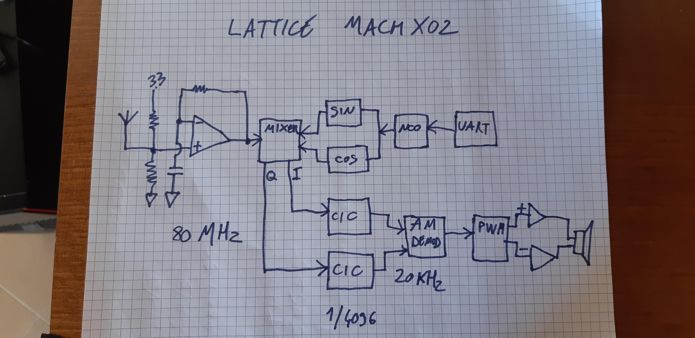

# Software Defined Radio(SDR) in High Level Synthesis(HLS)

The github repository delves into the development of a Software-Defined Radio (SDR) Receiver, which is conceptualized to operate on an Field Programmable Gate Array(FPGA) platform utilizing High-Level Synthesis (HLS). This approach is inspired by a [notable project](https://hackaday.io/project/170916-fpga-3-r-1-c-mw-and-sw-sdr-receiver) conducted on a Lattice MACHXO2 Board, which demonstrated the feasibility
of receiving AM broadcasts with minimal analog components. The project underscores the shift towards digital processing within the FPGA, highlighting the importance of a robust understanding of Digital Signal Processing (DSP) for successful implementation. HLS comes into play as an advantageous methodology for DSP applications, especially in algorithm-based designs, due to its efficiency in prototyping and testing compared to traditional Verilog-based development.

In the forthcoming sections, we will go into the operational principles of the project, alongside potential enhancements, alterations, and comprehensive discussions on the DSP Modules integral to the SDR Receiver. Additionally, the project’s transition to a different platform, specifically the ULX3S board, will be outlined. Furthermore, the performance and functionality of the SDR Receiver will be evaluated through both Verilog and High-Level Synthesis (HLS) testing methodologies.

# 1bit SDR Project

The SDR Receiver's architecture starts with an antenna capturing the RF signal, which is then enhanced through oversampling at an 80 MHz FPGA clock to improve signal resolution and quality. The signal passes through a voltage divider into a Sigma-Delta Modulator comprising a comparator (operating with LVDS) and an integrator, marking the system's transition from analog to digital. This stage outputs a 1-bit data stream, which is mixed with quadrature sine and cosine waves generated by a Numerically Controlled Oscillator (NCO). The NCO's frequency is dynamically adjustable via a UART PC connection, matching the desired carrier wave frequency.

The mixed signal, encoded with Binary Phase Shift Keying (BPSK), is filtered through a Cascaded Integrator-Comb (CIC) filter, implementing low-pass filtering and decimation (reducing the sample rate by 1/4096). Subsequently, the signal is demodulated (AM), converted into a Pulse Width Modulation (PWM) signal tailored for audio output, and finally amplified to drive speakers for sound reproduction. This process illustrates the fusion of analog and digital techniques in a modern SDR receiver for high-quality audio.

# ULX3S FPGA Board

